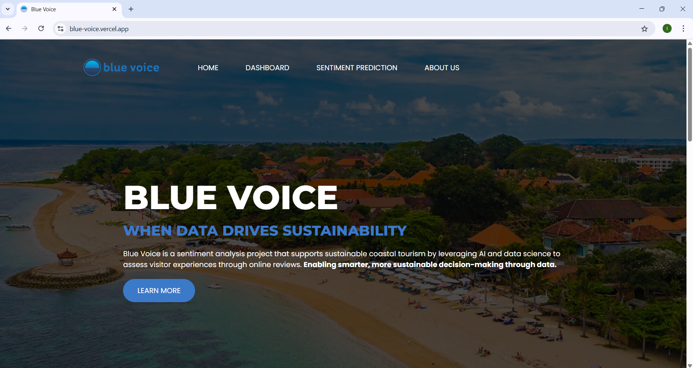
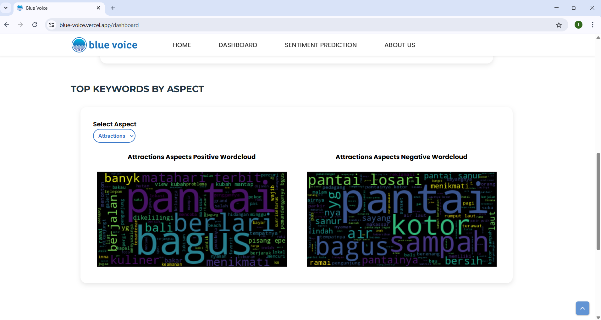
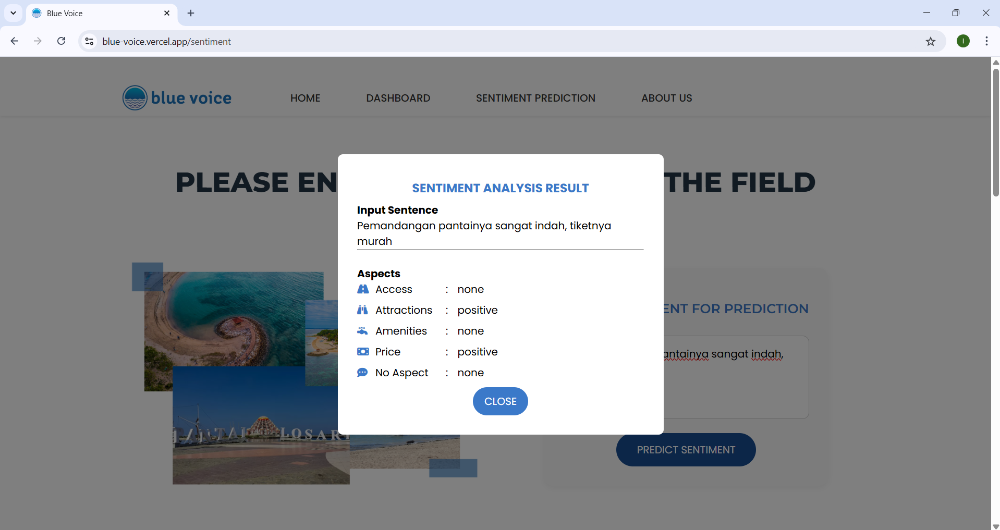

# Blue Voice: Analisis Sentimen Berbasis Aspek dan Pemodelan Topik pada Ulasan Wisatawan Terhadap Pantai Sanur dan Pantai Losari untuk Pengembangan Wisata Pesisir Berkelanjutan di Kawasan Tengah Indonesia


## By Otista 64C Team (LAI25-SM067)
- Astri Nur Innayah
- I Bagus Putu Swardanasuta
- Naufal Fadli Muzakki
- Putri Sekar Ayu

## Overview
Blue Voice adalah proyek analisis sentimen yang mendukung pariwisata pesisir berkelanjutan dengan memanfaatkan AI dan *data science* untuk menilai pengalaman pengunjung melalui ulasan daring. **Peningkatan pengambilan keputusan yang lebih cerdas dan berkelanjutan melalui data.**

## Installation

### 1. Clone this repository
```
git clone https://github.com/agusswardanaa/blue-voice.git
```

### 2. Virtual environment setup
```
conda create --name main-ds python=3.9
conda activate main-ds
cd blu-voice
pip install -r requirements.txt
```

### 3. Run the backend
```
uvicorn app:app
```

### 4. Run the frontend
```
cd web
python -m http.server 5500
```
Open `http://127.0.0.1:5500` in the browser.

## Data Understanding
*Dataset* yang digunakan dalam proyek ini adalah ulasan pengunjung Pantai Losari dan Pantai Sanur yang diperoleh dari Google Maps dan Tripadvisor dengan cara *scraping* menggunakan *library* Playwright. *Dataset* dapat diakses melalui tautan [berikut](https://docs.google.com/spreadsheets/d/1CISYtu35GKbYeOuj67h4EawV75D_39l2/edit).
- 1927 *record* untuk ulasan pengunjung Pantai Losari
- 2041 *record* untuk ulasan pengunjung Pantai Sanur

## Data Preparation

### 1. *Text Preprocessing*
Text cleaning, casefolding, tokenisasi, eliminasi stopwords

### 2. *Feature Extraction*
Teks yang sudah bersih diekstrak ke dalam bentuk TF-IDF

### 3. *Oversampling*
Distribusi kelas pada *dataset* tidak seimbang (*imbalanced*) sehingga diterapkan SMOTE

### 4. *Data Splitting*
*Dataset* dibagi menjadi data *training*, *validation*, dan *testing* dengan proporsi 80/10/10

## Modeling
Untuk klasifikasi sentimen, proyek ini menggunakan 2 model, yaitu random forest dan neural network.

## Evaluation
Tabel 1 menyajikan perbandingan akurasi model random forest dan neural netowrk pada masing-masing aspek.

Tabel 1. Hasil evaluasi model
| Aspek       | Neural Network | Random Forest |
|-------------|--------------- |---------------|
| Attractions | 0,9444         | 0,8655        |
| Amenities   | 0,9444         | 0,9061        |
| Access      | 0,9970         | 0,9915        |
| Price       | 0,9995         | 0,9941        |
| No Aspect   | 0,9398         | 0,9143        |

## Deployment
*Model deployment* diimplementasikan dalam sebuah web yang menampilkan visualisasi data dan prediksi sentimen berdasarkan input dari pengguna.  
[](https://blue-voice.vercel.app)

### Web Preview




